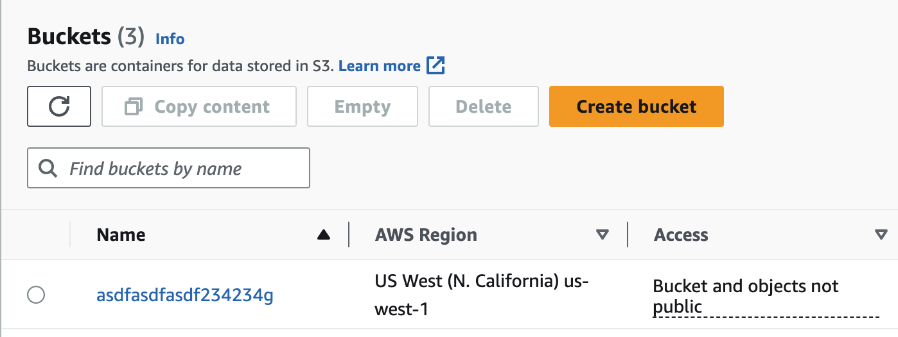
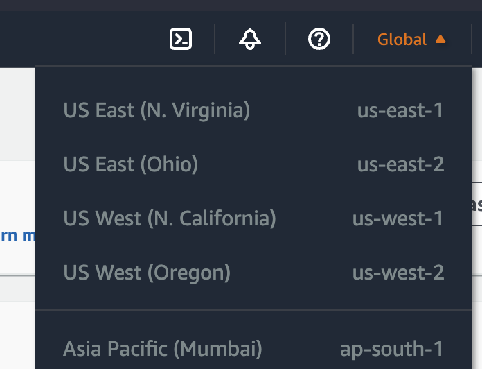

# What is Terraform?

[Terraform](https://www.terraform.io/) is a solution developed by HashiCorp for provisioning infrastructure resources via code (aka Infrastructure-as-Code or IaC for short) in a declarative language. Declarative here means we can define the **end state** of our infrastructure rather than the individual steps to achieve that state. 

You might be wondering how this is done? Well, it relies on Terraform **Providers** and there are tons of providers out there such as those for AWS, Azure, GCP, Kubernetes, Salesforce, Snowflake, and more! A full listing can be found in the [providers registry](https://registry.terraform.io/browse/providers). Some of these providers are created by the product owners e.g., Microsoft supports the Azure provider and AWS supports the AWS provider, but some are also supported by the community! Providers are simply code that abstracts API calls to these products so we don't need to worry about doing that ourselves! All we need to worry about is writing HCL code. Don't worry, we'll be diving into creating some AWS resources with terraform shortly!

## Codifying an AWS S3 Bucket in Terraform
Now that you have an understanding of Terraform, let's create our first infrastructure - an [AWS S3 bucket](https://aws.amazon.com/s3/)! S3 buckets allow for storing unlimited amounts of data in the AWS cloud and can be shared publicly or privately. Let's refer to the AWS Provider's [resource documentation](https://registry.terraform.io/providers/hashicorp/aws/latest/docs/resources/s3_bucket) to learn how to do this. By [default](https://github.com/hashicorp/terraform-provider-aws/issues/28353), the code below will create a **private** S3 bucket.

**NOTE:** *This is a simple configuration for the sake of example and as you move throughout this course you'll learn how to further refine this code more in-depth.*

```
# Open your IDE then copy this code into a file e.g., `main.tf` and change the elements within the brackets < >
provider "aws" {
    region = "<AWS-REGION->"
}

resource "aws_s3_bucket" "<RESOURCE_NAME>" {
  bucket = "<UNIQUE-BUCKET-NAME>"

  tags = {
    Team        = "<TEAM-THIS-BELONGS-TO>"
    Environment = "<ENV-DEPLOYED-IN>"
  }
}
```
**Code Syntax**
- `AWS-REGION` - This will be the AWS region the S3 bucket gets deployed to. This won't matter too much for the example, but you can review the list of [AWS regions](https://docs.aws.amazon.com/AWSEC2/latest/UserGuide/using-regions-availability-zones.html#concepts-regions) and select one closest to you e.g., `us-east-1`.

- `RESOURCE_NAME` - This will be the name terraform uses to refer to this resource (the s3 bucket)
- `UNIQUE-BUCKET-NAME` - Every S3 bucket in the world must have a unique name or this will fail to create

- The `tags = {}` section is entirely optional but good practice. Tags exist as a **key=value** pair and can be whatever you want.

Once you've updated the values, move on to the next section and learn how to deploy your bucket. 


## Terraform Commands
This section summarizes some of the commands you'll use regularly when working with Terraform. Run these commands in the Configuration directory (aka where your terraform files like `main.tf` exist).

`terraform fmt` - (Optional) This will ensure the code is correctly formated e.g., removing unnecessary indentation. 

`terraform validate` - (Optional) This will verify the syntax of the code is correct e.g., verifying required values are present.

`terraform init` - This will initialize the directory and prepare for the code to be run.

`terraform plan` - This will perform a dry-run and summarize what changes (if any) to the infrastructure defined will be made if this code is applied. 

`terraform apply` - This applies the code once you type the keyword "yes", when prompted. The infrastructure will begin being built or modified.

`terraform apply` - This destroys the infrastructure defined once you type the keyword "yes", when prompted.


## Deploying an AWS S3 Bucket via Terraform
You're now ready to deploy your first infrastructure via Terraform! Once you've run the `terraform apply` command, the S3 bucket will be built. You can view this in the [AWS console](https://s3.console.aws.amazon.com/).

<p align="center">
  
</p>

**NOTE:** *If you don't see your bucket (and you didn't get an error when deploying the code) verify you're in the correct AWS region within the console*

<p align="center">
  
</p>


## Tearing Down Infrastructure via Terraform
Great job making it this far! Now, the final thing we should do is delete the S3 bucket, but don't worry, you now have the code to create it again if you want!

Run this command to delete the bucket: ```terraform delete```